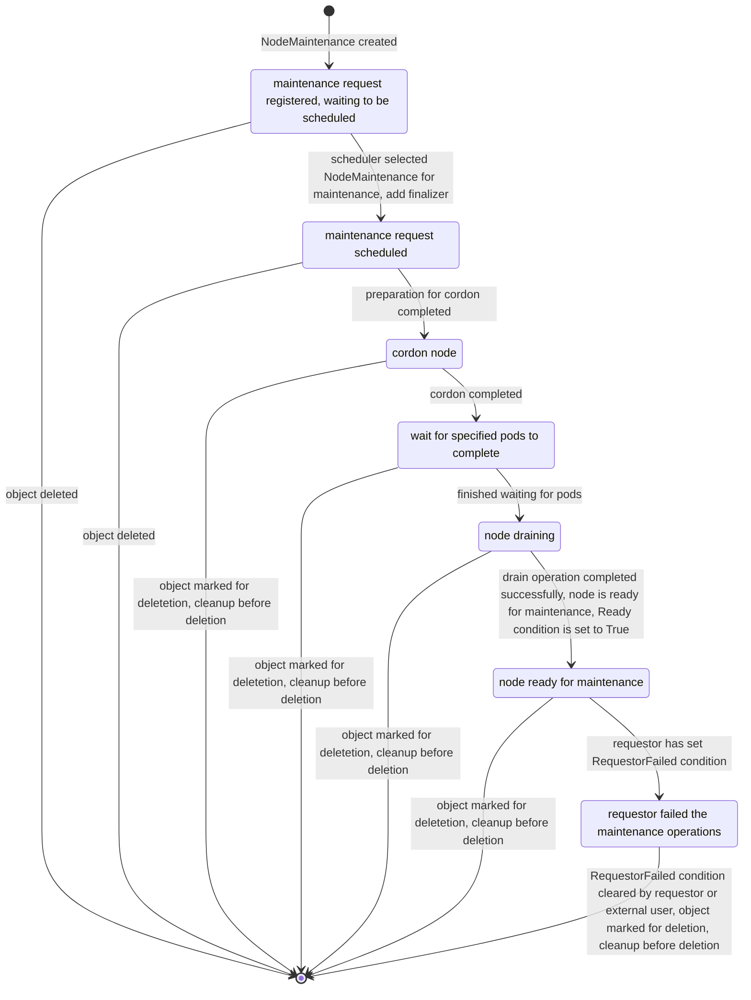

[](http://www.apache.org/licenses/LICENSE-2.0)
[](https://goreportcard.com/report/github.com/Mellanox/maintenance-operator)
[](https://coveralls.io/github/Mellanox/maintenance-operator)
[](https://github.com/Mellanox/maintenance-operator/actions/workflows/build-test-lint.yml)
[](https://github.com/Mellanox/maintenance-operator/actions/workflows/codeql.yml)
[](https://github.com/Mellanox/maintenance-operator/actions/workflows/image-push-main.yml)

# NVIDIA Maintenance Operator

NVIDIA Maintenance Operator provides Kubernetes API(Custom Resource Definition) to allow node maintenance operators in K8s cluster
in a coordinated manner. It performs some common operations to prepare a node for maintenance such as cordoning
the node as well as draining it.

Users/Consumers can request to perform maintenance on a node by creating NodeMaintenance Custom Resource(CR).
The operator will then reconcile NodeMaintenance CRs. At high level this the the reconcile flow:

1. Scheduling - schedule NodeMaintenance to be processed by the operator, taking into account constraints
  such as the maximal allowed parallel operations.
2. Node preparation for maintenance such as cordon and draning of the node
3. Mark NodeMaintenance as Ready (via condition)
4. Cleanup on deletion of NodeMaintenance such as node uncordon

## Deployment

### Prerequisites

* Kubernetes cluster

### Helm

#### Deploy latest from project sources

```bash
# Clone project
git clone https://github.com/Mellanox/maintenance-operator.git ; cd maintenance-operator

# Install Operator
helm install -n maintenance-operator --create-namespace --set operator.image.tag=latest maintenance-operator ./deployment/maintenance-operator-chart

# View deployed resources
kubectl -n maintenance-operator get all
```

> [!NOTE]
> Refer to [helm values documentation](deployment/maintenance-operator-chart/README.md) for more information

#### Deploy last release from OCI repo

```bash
helm install -n maintenance-operator --create-namespace maintenance-operator oci://ghcr.io/mellanox/maintenance-operator-chart
```

### Kustomize (for development)

```bash
# clone project
git clone https://github.com/Mellanox/maintenance-operator.git ; cd maintenance-operator

# build image
IMG=harbor.mellanox.com/cloud-orchestration-dev/adrianc/maintenance-operator:latest make docker-build

# push image
IMG=harbor.mellanox.com/cloud-orchestration-dev/adrianc/maintenance-operator:latest make docker-push

# deploy
IMG=harbor.mellanox.com/cloud-orchestration-dev/adrianc/maintenance-operator:latest make deploy

# undeploy
make undeploy
```

## CRDs

### MaintenanceOperatorConfig

The MaintenanceOperatorConfig CRD is used for operator runtime configuration

for more information refer to [api-reference](docs/api-reference.md)

#### Example MaintenanceOperatorConfig

```yaml
apiVersion: maintenance.nvidia.com/v1alpha1
kind: MaintenanceOperatorConfig
metadata:
  name: default
  namespace: maintenance-operator
spec:
  logLevel: info
  maxParallelOperations: 4
```

In this example we configure the following for the operator:

* Log level (`logLevel`) is set to `info`
* The max number of parallel maintenance operations (`maxParallelOperations`) is set to `4`

### NodeMaintenance

The NodeMaintenance CRD is used to request to perform a maintenance operation on a specific K8s node.
In addition, it specifies which common (K8s related operations) need to happend in order to preare a node for maintenance.

Once the node is ready for maintenance the operator will set `Ready` condition in `status` field to `True`
After maintenance operation was done by the requestor, NodeMaintenance CR should be deleted to finish the maintenance operation.

for more information refer to [api-reference](docs/api-reference.md)

#### Example NodeMaintenance

```yaml
apiVersion: maintenance.nvidia.com/v1alpha1
kind: NodeMaintenance
metadata:
  name: my-maintenance-operation
  namespace: default
spec:
  requestorID: some.one.acme.com
  nodeName: wokrer-01
  cordon: true
  waitForPodCompletion:
    podSelector: "app=important"
    timeoutSeconds: 0
  drainSpec:
    force: true
    podSelector: ""
    timeoutSeconds: 0
    deleteEmptyDir: true
    podEvictionFilters:
    - byResourceNameRegex: nvidia.com/gpu-*
    - byResourceNameRegex: nvidia.com/rdma*

```

In this example we request to perform maintenance for node `worker-1`.

the following steps will occur before the node is marked as ready for maintenance:

1. cordon of `worker-1` node
2. waiting for pods with `app: important` label to finish
3. draining of `worker-1` with the provided `drainSpec`
    1. force draining of pods even if they dont belong to a controller
    2. allow draining of pods with emptyDir mount
    3. only drain pods that consume either `nvidia.com/gpu-*`, `nvidia.com/rdma*` resources

once the node is ready for maintenance `Ready` condition will be `True`

```bash
$ kubectl get nodemaintenances.maintenance.nvidia.com -A
NAME                       NODE        REQUESTOR           READY   PHASE   FAILED
my-maintenance-operation   worker-01   some.one.acme.com   True    Ready   
```

## NodeMaintenance State Diagram



## NodeMaintenance Scheduling Process

The maintenance operator uses the following scheduling algorithm to choose the next set of nodes to perform maintenance on.

### Step 1: Determine the number of slots available for node maintenance scheduling

The number of slots available for node maintenance scheduling is determined as follows:

1. Get the value of `MaintenanceOperatorConfig.Spec.MaxParallelOperations`
   - This can be an absolute number (e.g., `5`) or a percentage of total nodes (e.g., `"10%"`)
2. Get the current number of nodes that are under maintenance (have a `NodeMaintenance` CR which was already scheduled)
3. The number of available slots is determined by subtracting 2. from 1.

Let's mark this value as `availableSlots`.

### Step 2: Determine the number of nodes that can become unavailable in the cluster

The scheduler respects cluster availability limits by not exceeding `MaintenanceOperatorConfig.Spec.MaxUnavailable`.

1. Calculate the absolute number of nodes that can become unavailable in the cluster based on `MaintenanceOperatorConfig.Spec.MaxUnavailable`
   - This can be an absolute number (e.g., `3`) or a percentage of total nodes (e.g., `"20%"`)
   - If unspecified, no limit is applied
2. Determine the current number of unavailable nodes by summing:
   - The number of nodes that have `NodeMaintenance` CR in progress
   - The number of nodes that are unschedulable or not ready
3. Determine the number of additional nodes that can become unavailable by subtracting 2. from 1.

Let's mark this value as `canBecomeUnavailable`.

### Step 3: Determine a list of candidate nodes for maintenance

These are nodes that are targeted (via `NodeMaintenance.Spec.NodeName`) by `NodeMaintenance` objects that are **pending** (not yet scheduled).

> [!NOTE]
> A node that is already targeted by a `NodeMaintenance` object in progress will not be part of this list.

### Step 4: Determine the list of candidate `NodeMaintenance` objects

These are all `NodeMaintenance` objects that are targeting one of the candidate nodes from Step 3 above and are in the `Pending` state.

### Step 5: Rank candidate `NodeMaintenance` objects

Each candidate `NodeMaintenance` is ranked using the following criteria (ordered by priority):

1. Prioritizes requestors that already have `NodeMaintenance` objects in progress
2. Prioritizes requestors with fewer pending `NodeMaintenance` objects
3. Prioritizes by creation time (older > newer)

Higher-ranked objects are scheduled first.

### Step 6: Schedule `NodeMaintenance` objects

The scheduler selects `NodeMaintenance` objects for scheduling up to `availableSlots` (from Step 1), while ensuring that:

- No more than `canBecomeUnavailable` additional nodes become unavailable (from Step 2)
- If a target node is already unavailable, it doesn't count against the `canBecomeUnavailable` limit
- Only one `NodeMaintenance` object per node is scheduled (highest-ranked wins if multiple exist)

**Example**: With `availableSlots=3` and `canBecomeUnavailable=1`:
- If 2 requests target already-unavailable nodes and 1 targets an available node → all 3 can be scheduled
- If 3 requests target available nodes → only 1 can be scheduled

## Examples:

### Example 1: Parallel Operations Limit
- Cluster: 10 nodes (all available)
- Config: `MaxParallelOperations=2`, `MaxUnavailable=5`
- Pending: 5 maintenance requests
- **Result**: 2 requests scheduled (limited by MaxParallelOperations)

### Example 2: Availability Limit
- Cluster: 10 nodes (2 already unavailable)
- Config: `MaxParallelOperations=5`, `MaxUnavailable=3`
- Pending: 3 maintenance requests (all targeting available nodes)
- **Result**: 1 request scheduled (limited by MaxUnavailable: 3-2=1)
