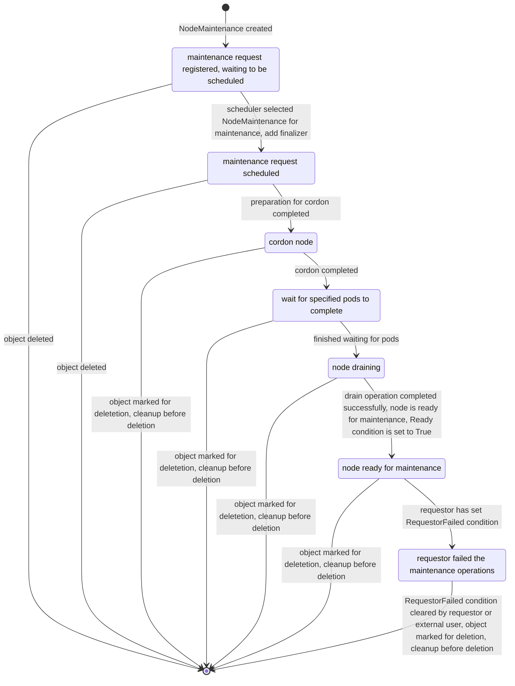

[](http://www.apache.org/licenses/LICENSE-2.0)
[](https://goreportcard.com/report/github.com/Mellanox/maintenance-operator)
[](https://coveralls.io/github/Mellanox/maintenance-operator)
[](https://github.com/Mellanox/maintenance-operator/actions/workflows/build-test-lint.yml)
[](https://github.com/Mellanox/maintenance-operator/actions/workflows/codeql.yml)
[](https://github.com/Mellanox/maintenance-operator/actions/workflows/image-push-main.yml)

# NVIDIA Maintenance Operator

NVIDIA Maintenance Operator provides Kubernetes API(Custom Resource Definition) to allow node maintenance operators in K8s cluster
in a coordinated manner. It performs some common operations to prepare a node for maintenance such as cordoning
the node as well as draining it.

Users/Consumers can request to perform maintenance on a node by creating NodeMaintenance Custom Resource(CR).
The operator will then reconcile NodeMaintenance CRs. At high level this the the reconcile flow:

1. Scheduling - schedule NodeMaintenance to be processed by the operator, taking into account constraints
  such as the maximal allowed parallel operations.
2. Node preparation for maintenance such as cordon and draning of the node
3. Mark NodeMaintenance as Ready (via condition)
4. Cleanup on deletion of NodeMaintenance such as node uncordon

## Deployment

### Prerequisites

* Kubernetes cluster

### Helm

#### Deploy latest from project sources

```bash
# Clone project
git clone https://github.com/Mellanox/maintenance-operator.git ; cd maintenance-operator

# Install Operator
helm install -n maintenance-operator --create-namespace --set operator.image.tag=latest maintenance-operator ./deployment/maintenance-operator-chart

# View deployed resources
kubectl -n maintenance-operator get all
```

> [!NOTE]
> Refer to [helm values documentation](deployment/maintenance-operator-chart/README.md) for more information

#### Deploy last release from OCI repo

```bash
helm install -n maintenance-operator --create-namespace maintenance-operator oci://ghcr.io/mellanox/maintenance-operator-chart
```

### Kustomize (for development)

```bash
# clone project
git clone https://github.com/Mellanox/maintenance-operator.git ; cd maintenance-operator

# build image
IMG=harbor.mellanox.com/cloud-orchestration-dev/adrianc/maintenance-operator:latest make docker-build

# push image
IMG=harbor.mellanox.com/cloud-orchestration-dev/adrianc/maintenance-operator:latest make docker-push

# deploy
IMG=harbor.mellanox.com/cloud-orchestration-dev/adrianc/maintenance-operator:latest make deploy

# undeploy
make undeploy
```

## CRDs

### MaintenanceOperatorConfig

The MaintenanceOperatorConfig CRD is used for operator runtime configuration

for more information refer to [api-reference](docs/api-reference.md)

#### Example MaintenanceOperatorConfig

```yaml
apiVersion: maintenance.nvidia.com/v1alpha1
kind: MaintenanceOperatorConfig
metadata:
  name: default
  namespace: maintenance-operator
spec:
  logLevel: info
  maxParallelOperations: 4
```

In this example we configure the following for the operator:

* Log level (`logLevel`) is set to `info`
* The max number of parallel maintenance operations (`maxParallelOperations`) is set to `4`

### NodeMaintenance

The NodeMaintenance CRD is used to request to perform a maintenance operation on a specific K8s node.
In addition, it specifies which common (K8s related operations) need to happend in order to preare a node for maintenance.

Once the node is ready for maintenance the operator will set `Ready` condition in `status` field to `True`
After maintenance operation was done by the requestor, NodeMaintenance CR should be deleted to finish the maintenance operation.

for more information refer to [api-reference](docs/api-reference.md)

#### Example NodeMaintenance

```yaml
apiVersion: maintenance.nvidia.com/v1alpha1
kind: NodeMaintenance
metadata:
  name: my-maintenance-operation
  namespace: default
spec:
  requestorID: some.one.acme.com
  nodeName: wokrer-01
  cordon: true
  waitForPodCompletion:
    podSelector: "app=important"
    timeoutSeconds: 0
  drainSpec:
    force: true
    podSelector: ""
    timeoutSeconds: 0
    deleteEmptyDir: true
    podEvictionFilters:
    - byResourceNameRegex: nvidia.com/gpu-*
    - byResourceNameRegex: nvidia.com/rdma*

```

In this example we request to perform maintenance for node `worker-1`.

the following steps will occur before the node is marked as ready for maintenance:

1. cordon of `worker-1` node
2. waiting for pods with `app: important` label to finish
3. draining of `worker-1` with the provided `drainSpec`
    1. force draining of pods even if they dont belong to a controller
    2. allow draining of pods with emptyDir mount
    3. only drain pods that consume either `nvidia.com/gpu-*`, `nvidia.com/rdma*` resources

once the node is ready for maintenance `Ready` condition will be `True`

```bash
$ kubectl get nodemaintenances.maintenance.nvidia.com -A
NAME                       NODE        REQUESTOR           READY   PHASE   FAILED
my-maintenance-operation   worker-01   some.one.acme.com   True    Ready   
```

## NodeMaintenance State Diagram


